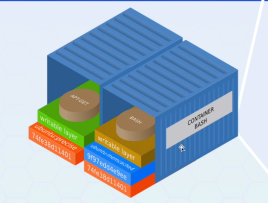

## Docker Containers

Docker é um projeto de código aberto que faz a auto implantação de aplicativos dentro de contêineres e é mantido pela empresa Docker, inc.

Docker faz a virtualização da virtualização, ele compartilha o kernel, mas fatia o CPU, o disco e tudo mais e essa fatia menor é o contêiner do Docker,
é uma "mini maquina virtual", é voltado pra um mundo de microsserviços embora dê pra rodar aplicações monolíticas e é projetado pra rodar
ou morrer e recriar em outro lugar do clustes e a aplicação continua rodando como se nada tivesse acontecido.

Fornece uma camada individual de virtualização utilizando recursos de isolamento do kernel do Linux como o CGGROUPS e namespaces, e um sistema de arquivos
union mounting como padrão overlay FS dando possibilidade ao uso de outros sistemas de arquivos.

https://en.wikipedia.org/wiki/OverlayFS 
https://en.wikipedia.org/wiki/Cgroups

 

## Container com a aplicação e serviços de ambiente e dados fora

A ideia é que o Docker Container rode apenas a aplicação ou serviços, e seus dados importantes fiquem fora do container, ou seja, deixando
o container como um ambiente descartável pra que possa desconstruir e remontar sem comprometer a integridade da aplicação/serviço.

Há vários containers rodando serviços diferentes e o kernel é compartilhado entre eles, importante ver como 2 containers com processos diferentes
dentro do mesmo barco pra quando formos ver a ideia de clusterização de containers.

 

## Container virtualiza o sistema operacional configurado e a VM virtualiza o hardware

Infraestrutura, a maquina, host operating system(onde vai ficar a maquina física) e um Hypervisor e em cima dele eu começo a criar a maquina virutal,
a imagem a direita, nos containers, nos temos a maquina, o sistema operacional e o Docket Engine é o cara no lugar o HyperVisor(cria VM), ele pega
a própria estrutura e contrói as VMs em cima da estrutura.

Se rodar o Docket Engine, vai ser mais eficiente, cada vez que adicionamos uma camada a mais, usamos CPU, memória e tal pra rodar em cima, ou seja
remove o Hyper Visor, joga o Docker Engine direto na infraestrutura e cria os containers.

 

## Por que usar?

- Implementações rapidas de aplicativos
> container incluem os requisitos mínimos de execução do aplicativo e reduz o tamanho e permite que seja implementado rapidamente, e a aplicação ja roda como que precisa, ou seja, o container não tem 50GB, vai ter 10mega, 20... só tem código pra rodar a aplicação, tp o ambiente postgree

- Portabilidade entre maquinas
> um aplicativo e todas as dependências podem ser empacotadas num único container e independente do kernel Linux da distribuição ou modelo de implantação, o ambiente fica igual, ou seja, se tem gente trabalhando com Linux, Windows(Docker pra windows), MacOs, diferentes versões de S.O ou ambiente, o container garante que o ambiente vai ficar igual.

- Controle de versão
> Há um histórico e logs de alteraçoes então é possível acompanhar o que foi alterado dentro do ambiente.

- Compartilhamento 
> pode usar repositório local ou remoto pra compartilhar usas iamgens e deixar o ambiente igual em qualquer maquina.

- Manutenção simplificada 
> Docker reduz o esforço e o risco de problemas com dependência de aplicativos. A ideia é criar a aplicação
e criar o ambiente no Docker pra que não tenha problema com versão de dependências e tudo mais.

