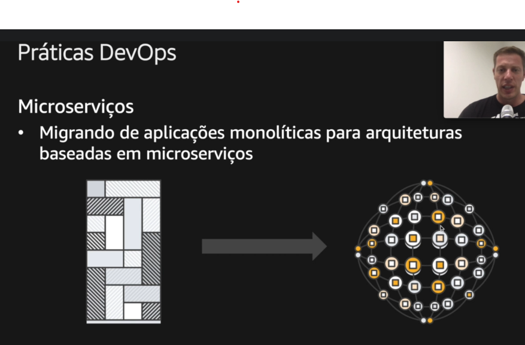

## DevOps

Um software muda rapidamente, a capacidade de fazer realise rapida, é algo primordial em qualquer empresa, um ambiente onde o software pode ser mudado rapidamente só favorece a empresa.

Num mundo DevOps, podemos obersavar algumas melhorias divulgadas pela AWS como:
- 5x menos chances de falhas(containers menores)
- 440x mais rapido entro commit e o deploy (com micro serviços, não precisa validar toda a aplicação apenas o que foi subido e a chamada)
- 46x deploy mais frequentes
- 44% mais tempo gasto com novas funcionalidades e código

 

## O que é o DevOps

É um conjunto de filosifias culturais, práticas e ferramentas

Quando usamos certas ferramentas, elas nos obrigam a usar certas práticas e aderir a alguams formas de desenvolvimentos alinhados com a filosofias cultural de um DevOps

 

# Cultura DevOps

- 
Dev & Ops caminham juntos

 > Dev não é separado a operação, no mundo DevOps isso se mistura, o kra que é dev e vai ajustar a maquina e as configurações e todo o ambiente,
 > porém ele ganha esse poder mas a responsabilidade de rodar isso em produção e o kra da operação tem q programar tbm
 > Ex: o limite de memória foi muito baixo e deu problema em produção, então O DEV. teve que alterar a memória.

- 
Microserviços

> Migrando aplicações monoliticas pra aplicações de microserviços, quando temos uma aplicação monilitica, temos um servidor usando
> muitas bibliotecas usando as msms dependencias e plugin, quando migra pra micro serviços, cada uma das funções(add usuario, register) tem so o codigo
> pra executar ela mas ela é conectada em varias outras e pode ser chamada ou não por varias outras e quando acaba, elas morrem

 
    
- 
Integração contínua e deploy contínuo

``Passar de um ambiente pra outro com automatizações e com o dev tendo liberdade pra cuidar das operações e ambiente de produção é integração contínua, é um processo como um todo onde o dev. tem total liberdade e o modo como ele pode enviar codigos pra produção``
    1. Código v1.1
    2. Dev. faz o commit e push
    3. O Source control (AUTOMATIZADO), entende que o código foi atualizado e dispara um evento que o codigo foi alteracao para o build
    4. O builder (AUTOMATIZADO) roda testes unitarios e recria/monta a aplicação(faz o build) e envia pro Staging
    5. Staging(AUTOMATIZADO) roda testes de carga, laod de teste e teste de integração
    6. Produção... Após passar por esses processos, quase todos automatizados, o dev. apenas precisa enviar do Staging pra produção
    7. Monitoramento com logs e métricas da aplicação de produção
    
 
    
 ``Ou seja, exatamente aquele código vai ser publicado em produção, o dev. passa pra produção também, dev e operação andam juntos e a configuração da maquina ja ta setada pelo docker na aplicação, será replicada em produção``
    
 
    
- 
Infraestrutura como um código

> Todos os recursos que vamos utilizar tem q estar em código como parte da aplicação

- Monitoramento e Log
> Monitoriamento e métricas de log, isso permite compreender o desemprenho da infra-estrutura e da aplicação em tempo real(e se foi aplicado pouca memória por exemplo).

 

## Benefícios
- Colaboração otimizada
- Entregas rápidas
- Confiabilidade de código e do ambiente
- Segurança
- Escala
- Velocidade

## Servicos de DevOps na AWS

A Amazon primeiro usa as suas aplicações e depois as diponibiliza como serviços, ela tinha alguns problemas em relação a Deploy, quebra de aplicação, teste, saber de quem era a responsabilidade(burocracia) e visibilidade da aplicação, desde 2009 ela começou a quebrar sua aplicação de microserviços e começou a resolver esses problemas
   
- Responsabilidade compartilhada
> O Dev também cuida da Operação e cuida do ambiente através de códigos, ou seja, ele assume total responsabilidade e bônus pelo código que ele subiu.
- Visibilidade e comunicação
> Permite acompanhar através de métricas e logs como o código está se comportando, se necessita de mais memória por exemplo.
- Problemas de CD/CI(publicação pra produção)
> Uma aplicação grande necessita ser bem testada, ou seja, demorava semanas ou meses pra um código ir pra produção e se houvesse algum erro, voltava pro desenvolvedor e levava mais semanas, com o CD/CI, o desenvolvedor cria o ambiente e o código, testa e ele pode colocar o código em produção em questão de horas.

## Problemas de CD/CI na AWS citado na lista a cima

Com o problema, resolveram fazer a pergunta de como fazer o ambiente de DevOps pra fazer essa entrega rapida? com ferramentas adequadas.

Melhorando a parte de deploy com CD/CI e microserviços com contêiners e kubernetes(e rancher?), mudou pra: 

## Pipelines

Ações automatizadas pra publicar um código em produção(CD/CI) mais rápido, mais seguro, simplicação e padronização, visualização do processo... automatização.

 

Pipeline mais comum:

    

Porém há variações como usando GitLab, GitLab faz o build... e envia pro Rancher(que gerencia o Kubernetes e que por sua vez gerencia o Docker e os containers), com essas 2 ferramentas, da pra fazer toda a integração contínua.

 

E por fim, na AWS funcionou bem, todo ano há várias pesquisar feitas na AWS e após algumas alterações como:

- Milhares de times empenhados microserviços na Amazon (cultura do Two pizza teams)
- Contruindo microserviços
- Utilizando entrega contínua
- Siversos ambientes pra colocar em produção(stagingm beta, production)

Houve uma melhora na entrega e segundo a Amazon AWS

<h1>Entrega contínua = devs. mais felizes</h1>

Pois o desenvolvedor tem liberdade pra cuidar do código, do ambiente e de colocar seu código em produção logo e monitorar ele.

## Two-Pizza Teams

Basicamente times pequenos que da pra fazer uma reunião/fazer trabalhar até tarde e alimentar todos com apenas 2 pizzas

Integra-los bem e assim o time fica mais produtivo

Link: https://docs.aws.amazon.com/whitepapers/latest/introduction-devops-aws/two-pizza-teams.html
