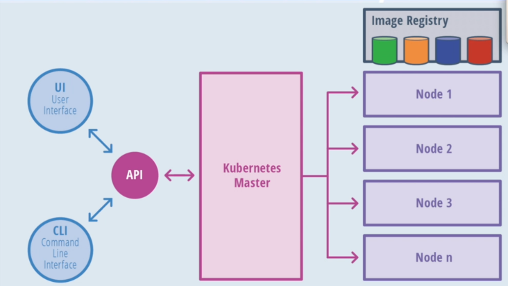
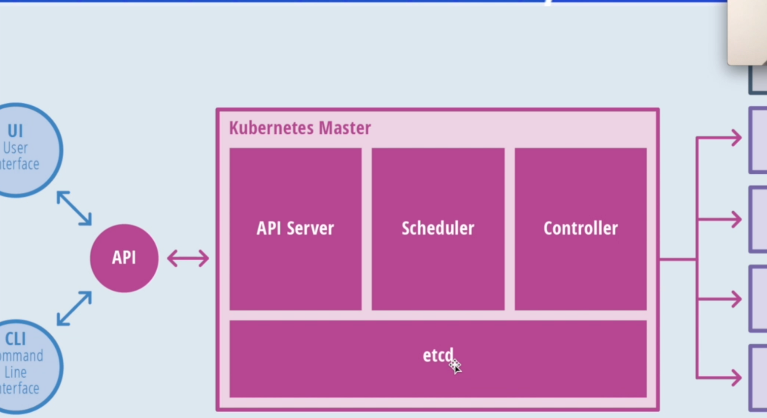
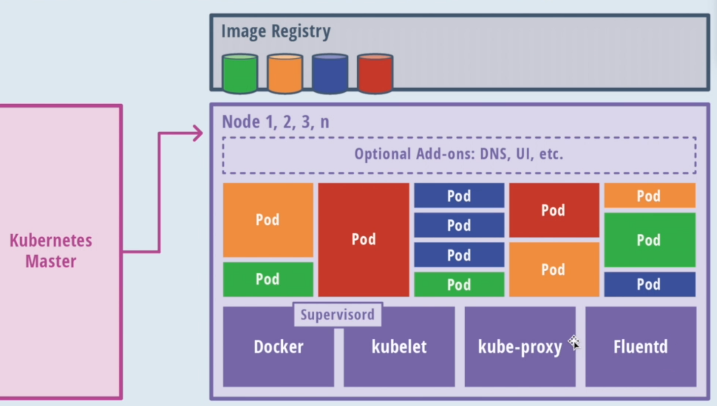

## Kubernetes 

Kubernetes é uma plataforma opensource que gerencia containers do Docker desenvolvida pela Google e pronta pro mundo multi-cloud. Possui desempenho modular e pode ser rodado em qualquer lugar

``Kubernetes é uma continuação do Google Borg``

 

## Arquitetura

É uma arquiterura flexivel, precisa pelo menos de um master e vários nós de comunicação
master é responsável pela API e o agentamento dos deployments e gerenciamento total do cluster
ou seja, tem o kubernetes master e varios nodes/aplicações em containers diferentes.

``Um cluster com um kubernetes master suporta até 5 mil nós.``

 

## Kubernetes Master

Kubernetes Master tem os seguintes recursos dentro dele:
- API server -> servidor de API
- Scheduler -> Agendador
- Controller -> Onde e pra quem vai enviar
- Etcd -> banco de dados do Kubernetes 

 

## Nós(Nodes)

Nós são tabalhadores do cluster, eles expões serviços de computação, rede e armazenamento pras aplicações.

Container contém
- Runtime
- Docker ou rocket, com os agentes pra se comunidade com o master (kubelet, kube-proxy.)
- Componentes adicionais pra logs
- Monitoramento 
- Service discovery
- Add-ons opcionais

E em cima disso temos as aplicações montadas nos nodes

 

## Componentes do Kubernetes pra usarmos em nossas aplicações containeirizadas

- Pods: Containers(que trabalham em conjuntoContainers)
- Services(Pods que trabalham em conjunto)
> Pra onde a gente vai expor o serviço e o serviço vai estar conectado a um container, um pod
- Deployments(Provê uma unica declaração pra pods e replica sets, template pra expor)
- Labels(Usado pra organizar serviços)
- Daemonsets(rodar sempre um ou mais pods por nó)
- Secrets(salvar dados sensitivos com senhs de bancos de dados)
- ConfigMaps (Arquivo de configuração que suas aplicações irão usar)
- Cronjobs(executar tarefas temporais)

Posso adicionar um secret por exemplo e apontar pra um arquivo fora de configuração

 

## O que podemos fazer

- Escrever deployments, diz como ele vai fazer e ele monta todo o ambiente e containers
- empacota recursos e fala quanto de CPU e memória vai usar... ex: vamos usar 2 cpu por exemplo
- service discovery e autoscaling(Kubernets automaticamente expoe seus containers pra internet no cluster, balanceia a trafego e atualiza os dns
e chega no container com ao deplyments).
- roda em qualquer lugar(multi cloud, posso ter 2 na amazon, 2 na google, 2 local).
- contém armazenamento
- HA é escalável(elas tem cluster e adiciona outros cluster... ex, uma empresa adquire outra e adiciona clusters de outras empresas)
