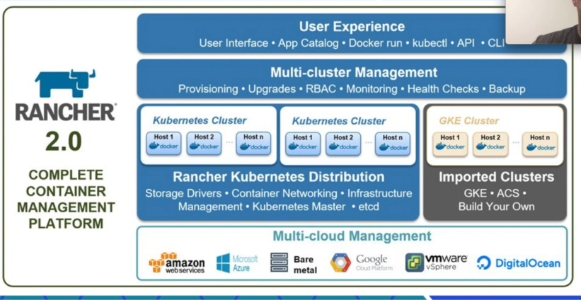

## Rancher

O rancher é um projeto opensource e tem um conjunto de códigos pra gerenciamento e orquestração de containers web, ele facilita o gerenciamento de aplicações em containers, os serviços do Rancher incluem ``Rede, armazenamento, volumes, balanceador de carga, DNS.``

Site: https://rancher.com/

 

## Em outras palavras, ele é um gerenciador de Kubernetes

Imagina que tem uma maquina e vários containers, e tenho mais 15 containers rodando em outra maquina, como esse container rodando bashs se comunica
com containers de outra maquina? usando Kubernetes, o Kubernetes vai gerenciar os containers, clusteriza elas e gerencia e o Rancher, orquestra 
e gerencia como o Kubernetes vai trabalhar, o Rancher automatiza todo cluster e produção/desenvolvimento, cluster de desaster recovery em 
outra parte da amazon, Rancher cria.

``Opinião do professor: Concorrente como openswift da RedHead mas não é tão sofisticado... pesquisar.``

## Rancher tem outros produtos como:

- K3S.io - Kubernetes pra Edge e IOT
> é um Kubernetes muito leve, muitos começaram a usar o desenvolvimento e o deplyment ficou muito bom, queria um
> Kubernetes no restaurantes, no terminal de pagamento, é um ambiente com muito pouco recurso, esse kubernetes pode rodar até num roteador

- Rancher Os - Sistema operacional da Rancher
> Uma imagem Linux de versão da Rancher, ele só tem o basico pra rodar container, varios comandos e o proprio sistema operacional é um container,
> um linux de 40 mega

- Github.com/longhorn/longhorn - Sistema de volumes pra containers
> Temos um banco de dados de banco maior e precisamos persistir os dados, precisa de um sistema que cria o volume pra que quando o container antigo for deletado e criado
> um novo sistema de container, esse novo sistema se conecta com o mesmo volume e os dados não se perdem.
> Basicamente persistir os dados

